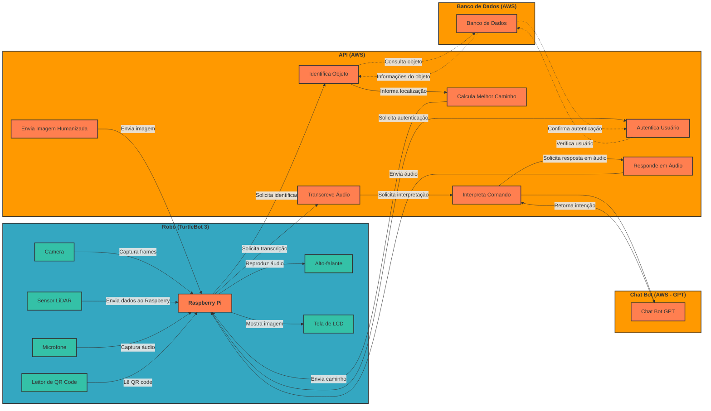

```mermaid
graph LR

    %% Defining the robot components
    subgraph Robo["<b>Robô (TurtleBot 3)</b>"]
        cam["Camera"]
        lidar["Sensor LiDAR"]
        mic["Microfone"]
        spk["Alto-falante"]
        lcd["Tela de LCD"]
        qr["Leitor de QR Code"]
        rpi["<b>Raspberry Pi</b>"]
    end

    %% Defining the API and its functionalities
    subgraph API_AWS["<b>API (AWS)</b>"]
        apiid[Identifica Objeto]
        apipath[Calcula Melhor Caminho]
        apitransc[Transcreve Áudio]
        apiint[Interpreta Comando]
        apiauth[Autentica Usuário]
        apiresp[Responde em Áudio]
        apiimg[Envia Imagem Humanizada]
    end

    %% Defining the database
    subgraph Banco_AWS["<b>Banco de Dados (AWS)</b>"]
        db["Banco de Dados"]
    end

    %% Defining the chatbot
    subgraph ChatBot_AWS["<b>Chat Bot (AWS - GPT)</b>"]
        gpt["Chat Bot GPT"]
    end

    %% Flow for the camera
    cam -->|Captura frames| rpi
    rpi -->|Solicita identificação| apiid
    apiid -.->|Consulta objeto| db
    db -.->|Informações do objeto| apiid
    apiid -->|Informa localização| apipath
    apipath -->|Envia caminho| rpi

    %% Flow for LiDAR
    lidar -->|Envia dados ao Raspberry| rpi

    %% Flow for microphone and speaker
    mic -->|Captura áudio| rpi
    rpi -->|Solicita transcrição| apitransc
    apitransc -->|Solicita interpretação| apiint
    apiint --> gpt
    gpt -->|Retorna intenção| apiint
    apiint -->|Solicita resposta em áudio| apiresp
    apiresp -->|Envia áudio| rpi
    rpi -->|Reproduz áudio| spk

    %% Flow for QR code
    qr -->|Lê QR code| rpi
    rpi -->|Solicita autenticação| apiauth
    apiauth -.->|Verifica usuário| db
    db -.->|Confirma autenticação| apiauth

    %% Flow for LCD
    apiimg -->|Envia imagem| rpi
    rpi -->|Mostra imagem| lcd

    %% Styling section
    classDef aws fill:#FF9900,stroke:#333,stroke-width:2px;
    class API_AWS,Banco_AWS,ChatBot_AWS aws;
    classDef robo fill:#34A7C1,stroke:#333,stroke-width:2px;
    class Robo robo;
    classDef hardware fill:#34C1A7,stroke:#333,stroke-width:2px;
    class cam,lidar,mic,spk,lcd,qr hardware;
    classDef processing fill:#FF7F50,stroke:#333,stroke-width:2px;
    class rpi,apiid,apipath,apitransc,apiint,apiauth,apiresp,apiimg,db,gpt processing;

```
