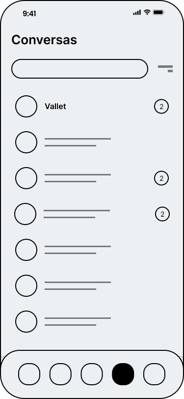
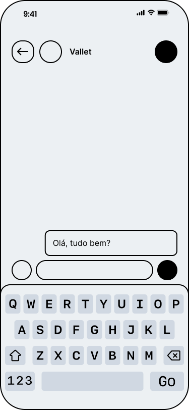

# Chatbot Whatsapp

Como interface de interação com o usuário, optou-se pelo WhatsApp, devido à sua ampla acessibilidade e popularidade, uma vez que é um aplicativo já instalado nos celulares da maioria dos usuários. No Brasil, 99% da população utiliza o aplicativo. O WhatsApp também facilita a criação de chatbots, que são sistemas automatizados capazes de interagir com o usuário por meio de mensagens de texto, voz, imagens, vídeos, documentos, localização e outros tipos de mídia. Esta integração beneficia os funcionários da Ambev, que não precisam se adaptar a uma nova ferramenta, já que o WhatsApp faz parte do seu cotidiano.

Por meio desta integração, os usuários podem interagir com o chatbot enviando perguntas e recebendo respostas via mensagens de texto. O chatbot é projetado para interpretar as mensagens enviadas, identificar a intenção por trás delas e fornecer a resposta mais adequada.

## Protótipo de Baixa Fidelidade

Para essa sprint 2, o grupo desenvolveu o protótipo de baxa fidelidade das interações e funções que o usuário irá ter com o chatbot. O protótipo foi desenvolvido no Figma, uma ferramenta de design que permite a criação de protótipos de baixa e alta fidelidade. O protótipo pode se acessado por meio do [link de acesso](https://www.figma.com/file/30UeP53WIJoLGIjlzd61if/Pr%C3%B3totipo-de-Baixa-Fidelidade?type=design&node-id=0%3A1&mode=design&t=G1gccUgdLWDn5Nad-1). Lá será possivel encontrar o prototipo de baixa fidelidade do chatbot, e também o prototipo de baixa fidelidade do display e página web de cadastro do chatbot.

## Integração com o WhatsApp

A integração com o WhatsApp é realizada por meio de uma árvore de interação e decisão, desenvolvida na linguagem de programação TypeScript. Esta abordagem permite uma programação mais robusta da aplicação. Todo o processo é construído com o auxílio da biblioteca whatsapp-web.js, que simula um cliente do WhatsApp Web. Isso possibilita a troca de mensagens entre o chatbot e o usuário.

### Árvore de Interação

Atualemente a árvore de interação do chatbot é possuir 4 funcionalidades rodando, sendo eles:

1- Verificação de acesso: O chatbot verifica se o usuário possui acesso ao sistema, caso não possua, o chatbot solicita que o usuário fale com um atendente.
2- Acompanhamento de pedido: O chatbot verifica se o usuário deseja acompanhar o status de um pedido, caso sim, o chatbot solicita o número do pedido e retorna o status do pedido.
3- Cancelamento de pedido: O chatbot verifica se o usuário deseja cancelar um pedido, caso sim, o chatbot solicita o número do pedido e cancela o pedido.
4- Falar com um atendente: O chatbot verifica se o usuário deseja falar com um atendente, caso sim, o chatbot envia o contato de um atendente para o usuário entrar em contato.
5- Alteração no nome do usuário: O chatbot verifica se o usuário deseja alterar o nome cadastrado no sistema, caso sim, o chatbot solicita o novo nome do usuário e altera o nome cadastrado no sistema.

## Conclusão

Entendemos que o chatbot desempenhará um papel fundamental no projeto desenvolvido, atuando como interface de interação entre o usuário e o robô. Por meio do chatbot, o usuário poderá solicitar a movimentação de peças, acompanhar o status de pedidos, cancelar pedidos e entrar em contato com um atendente. Adicionalmente, o chatbot será responsável por enviar notificações ao usuário, como, por exemplo, informar quando o robô estiver a caminho do almoxarifado para entregar uma peça.

Este processo de desenvolvimento é extenso, e a equipe tem se dedicado a ele desde a sprint 1, com especial atenção a essa parte do projeto, principalmente após a visita à Cervejaria Ambev em Guarulhos. Essa experiência permitiu uma compreensão mais aprofundada do processo de movimentação de peças e de como o chatbot pode ser útil nesse contexto. Reconhecemos que esta tecnologia é a única em que o almoxarife confia plenamente, e a facilidade de uso pode contribuir significativamente para a eficiência do trabalho dessa persona e dos demais funcionários da Ambev.