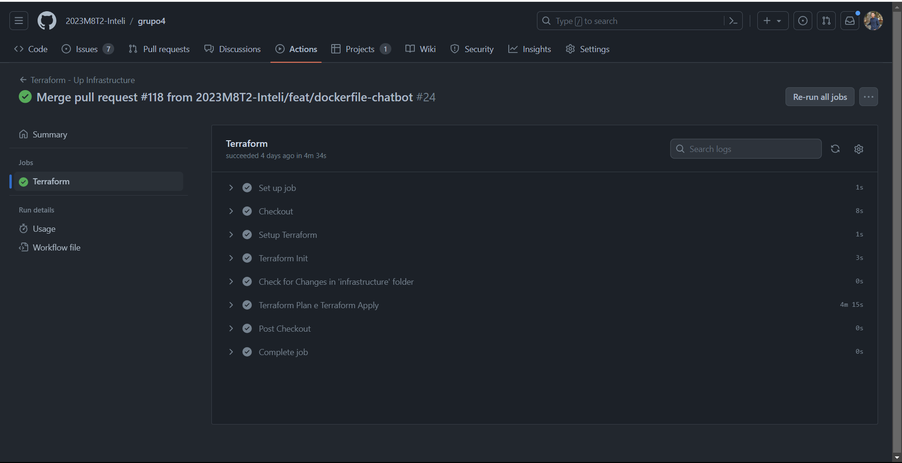

# Infraestrutura na AWS com Terraform

## Introdução

A implementação da arquitetura em nuvem utilizando o Terraform é um passo crucial para alcançar eficiência, escalabilidade e segurança no desenvolvimento e operação dos sistemas. O uso do Terraform para provisionar e gerenciar a infraestrutura na AWS (Amazon Web Services) assegura consistência e facilidade no manejo dos recursos. A integração de componentes-chave como um chatbot no WhatsApp, Interface Web Admin e o Turtlebot3, em um único sistema em nuvem, cria uma solução robusta e adaptável para atender às necessidades dinâmicas do projeto.

## Benefícios

1. **Eficiência Operacional** : Redução de tempo e esforço no gerenciamento de infraestrutura.
2. **Escalabilidade** : Facilidade em escalar recursos conforme a demanda do sistema.
3. **Segurança Reforçada** : Melhor controle e segurança na infraestrutura.
4. **Consistência** : Redução de inconsistências e erros humanos.
5. **Flexibilidade** : Capacidade de adaptação rápida a novas necessidades e tecnologias.

## Serviços da AWS

1. **EC2 (Elastic Compute Cloud)**
   * **Descrição** : Hospeda os servidores back-end e front-end da aplicação.
   * **Benefícios** : Oferece flexibilidade para escalar recursos e Elastic IP para endereços IP estáticos e confiáveis.
   * **Terraform** : Scripts para provisionamento e gerenciamento de instâncias EC2.
2. **RDS (Relational Database Service)**
   * **Descrição** : Gerencia o banco de dados.
   * **Benefícios** : Facilita operações como backup, recuperação e patching.
   * **Terraform** : Automatização da configuração e manutenção do RDS.
3. **CloudWatch**
   * **Descrição** : Monitoramento de desempenho e logs.
   * **Benefícios** : Permite análise em tempo real e troubleshooting.
   * **Terraform** : Integração para configuração de alertas e monitoramento.
4. **VPC (Virtual Private Cloud)**
   * **Descrição** : Isolamento e proteção da infraestrutura na nuvem.
   * **Benefícios** : Rede privada virtual segura na AWS.
   * **Terraform** : Scripts para criação e gerenciamento da VPC.
5. **Elastic IP**
   * **Descrição** : Endereços IP estáticos para instâncias EC2.
   * **Benefícios** : Facilita o gerenciamento de endereços IP e a comunicação com a internet.
   * **Terraform** : Provisionamento e associação de Elastic IPs às instâncias.
6. **Security Group**
   * **Descrição** : Define regras de segurança para controlar o tráfego para instâncias.
   * **Benefícios** : Garante segurança ao nível da rede.
   * **Terraform** : Definição e aplicação de políticas de segurança.

## Configurações Chave no Terraform

Estes arquivos se encontram na pasta [infrastructure](https://github.com/2023M8T2-Inteli/grupo4/tree/main/infrastructure) do nosso repositório.

#### `provider.tf` e `variables.tf`

- **Estrutura Fundamental**: Estes arquivos estabelecem a base da nossa infraestrutura. `provider.tf` configura o acesso ao provedor AWS, essencial para todas as operações na nuvem. `variables.tf` define variáveis cruciais como a região da AWS, detalhes de sub-redes e zonas de disponibilidade, oferecendo flexibilidade e possibilitando a personalização da infraestrutura.

#### `ec2.tf`

- **Máquinas Virtuais para Aplicações**: Define detalhadamente as instâncias EC2, incluindo tipos de instâncias, configurações de AMI e chaves de acesso. Essas instâncias, como a `chatbot_host`, são vitais para executar o chatbot e outras aplicações, garantindo desempenho e disponibilidade.

#### `network.tf`

- **Configuração de Rede Abrangente**: Detalha a criação de gateways de internet, endereços IP elásticos e gateways NAT, fundamentais para a conectividade e acessibilidade externa. Essas configurações são cruciais para o funcionamento ininterrupto das aplicações hospedadas.

#### `security_group.tf`

- **Segurança Reforçada**: Especifica grupos de segurança, estabelecendo regras detalhadas para o tráfego de entrada e saída. Isso é especialmente importante para proteger o banco de dados e outras instâncias, permitindo apenas tráfego autorizado e prevenindo acessos não desejados.

#### `vpc.tf`

- **Isolamento e Gerenciamento de Rede**: Explica a criação e configuração da VPC, incluindo detalhes sobre blocos CIDR, suporte a DNS e tags para identificação. A VPC serve como uma rede isolada dentro da AWS, crucial para segurança e organização eficiente dos recursos de rede.

#### `elastic_ip.tf`

- **Estabilidade de Conexão com IPs Elásticos**: Aloca endereços IP estáticos para instâncias críticas, garantindo que serviços essenciais, como o chatbot e a interface web, mantenham a conectividade constante, um aspecto vital para a confiabilidade do sistema.

#### `elastic_container_registry.tf`

- **Gerenciamento Ágil de Contêineres**: Cria e gerencia repositórios no AWS ECR, permitindo o armazenamento seguro e a gestão eficiente de imagens de contêineres. Essa configuração apoia a implantação rápida e flexível de aplicações, essencial para atualizações regulares e manutenção.

#### `database.tf`

- **Armazenamento de Dados Centralizado e Seguro**: Configura o ambiente de banco de dados na AWS, incluindo a definição de sub-redes e configurações de segurança. Detalha como o banco de dados é integrado ao sistema para armazenar informações do chatbot e outros dados essenciais.

## Configurações de Chave da AWS

O terraform utiliza as credenciais da AWS para acessar e gerenciar os recursos na nuvem. Para garantir a segurança e proteção dos dados, as credenciais são armazenadas em um arquivo `terraform.tfvars` que não é versionado no GitHub. O arquivo `terraform.tfvars` é criado localmente e deve ser adicionado ao arquivo `.gitignore` para evitar que as credenciais sejam expostas publicamente. O arquivo `terraform.tfvars` deve ser criado no diretório `infrastructure` e deve conter as seguintes informações:

```terraform
AWS_REGION = "us-east-1"
AWS_ACCESS_KEY_ID = "minhaChaveDeAcesso"
AWS_SECRET_ACCESS_KEY = "minhaChaveSecreta"
AWS_SESSION_TOKEN = "meuTokenDeSessao"
```
As credenciais podem ser obtidas no console da AWS. Para mais informações, consulte a [documentação da AWS](https://docs.aws.amazon.com/pt_br/cli/latest/userguide/cli-configure-files.html). Após a criação do arquivo `terraform.tfvars`, o Terraform pode ser inicializado e executado localmente ou no GitHub Actions passando as credenciais como variáveis de ambiente no arquivo `variables.yml` colocando no valor `dafault`.

## Exemplo de Uso de Terraform

### Uso Local

#### Instalação do Chocolatey

1. **Abrir o PowerShell**: 
   - Execute o PowerShell como administrador.

2. **Executar o Script de Instalação**:
   - Copie e cole o seguinte comando:
     ```powershell
     Set-ExecutionPolicy Bypass -Scope Process -Force; [System.Net.ServicePointManager]::SecurityProtocol = [System.Net.ServicePointManager]::SecurityProtocol -bor 3072; iex ((New-Object System.Net.WebClient).DownloadString('https://chocolatey.org/install.ps1'))
     ```

3. **Verificar Instalação**:
   - Após a conclusão, digite `choco` no PowerShell. Se a instalação estiver correta, você verá uma mensagem com a versão do Chocolatey.

#### Instalação do Terraform

1. **Instalar Terraform via Chocolatey**:
   - No PowerShell (como administrador), execute:
     ```powershell
     choco install terraform
     ```

2. **Verificar Instalação**:
   - Para confirmar a instalação, digite `terraform -version` no PowerShell.

#### Execução de Scripts Terraform

1. **Navegar até o Diretório do Projeto**:
   - Use o comando `cd infrastructure` para navegar até o diretório onde os scripts do Terraform estão localizados.

2. **Inicializar Terraform**:
   - Execute `terraform init` para inicializar o Terraform no diretório.

3. **Criar Plano de Execução**:
   - Execute `terraform plan` para revisar as mudanças propostas.

4. **Aplicar Configurações**:
   - Para aplicar as configurações, execute `terraform apply`.

5. **Confirmar Aplicação**:
   - Quando solicitado, confirme a aplicação das configurações.

### Uso do GitHub Actions

O grupo optou por utilizar o GitHub Actions para automatizar o processo de provisionamento e gerenciamento da infraestrutura na AWS. O GitHub Actions é um serviço de integração contínua (CI) e implantação contínua (CD) que permite a automação de tarefas de desenvolvimento de software. Dessa forma, podemos automatizar o processo de provisionamento e gerenciamento da infraestrutura na AWS, garantindo que as mudanças no código sejam refletidas na infraestrutura em nuvem. O GitHub Actions é integrado ao GitHub, o que facilita a configuração e execução de pipelines CI/CD.

O workflow "Terraform - Up Infrastructure" é projetado para ser executado no GitHub Actions. Ele automatiza a implementação de infraestrutura usando Terraform sempre que mudanças são feitas no diretório `infrastructure` na branch `main` do repositório.

#### Configuração do Workflow

1. **Evento de Gatilho**: 
   - **Push**: O workflow é ativado por eventos de `push` na branch `main` que incluam alterações na pasta `infrastructure/**`.

2. **Permissões**:
   - **contents: read**: O workflow tem permissão de leitura do conteúdo do repositório.

#### Jobs

Os jobs são executados em paralelo, o que permite que o workflow seja executado de forma mais rápida e eficiente.

##### Ambiente de Execução
- **runs-on**: Ubuntu-latest.
- **environment**: Production.

##### Steps

1. **Checkout**
   - **action**: `actions/checkout@v2`.
   - **descrição**: Faz o checkout do código no runner.

2. **Setup Terraform**
   - **action**: `hashicorp/setup-terraform@v1`.
   - **with**:
     - **cli_config_credentials_token**: Utiliza um token armazenado em `secrets.TF_API_TOKEN`.
   - **descrição**: Configura o Terraform no ambiente do runner.

3. **Terraform Init**
   - **run**: `cd infrastructure && terraform init`.
   - **descrição**: Inicializa o Terraform no diretório `infrastructure`.

4. **Check for Changes in 'infrastructure' folder**
   - **run**: Script para verificar se houve mudanças na pasta `infrastructure`.
   - **descrição**: Determina se é necessário executar os comandos subsequentes do Terraform.

5. **Terraform Plan e Terraform Apply**
   - **run**: `cd infrastructure && terraform plan -input=false -out=tfplan && terraform apply -auto-approve -input=false tfplan`.
   - **descrição**: Executa `terraform plan` para criar um plano de execução e `terraform apply` para aplicar as mudanças na infraestrutura.

##### Funcionamento

Quando ocorre um `push` na branch `main` com mudanças na pasta `infrastructure`, o workflow é acionado. Ele executa uma série de passos, incluindo o setup do Terraform, inicialização, verificação de mudanças e, se necessário, a aplicação do plano Terraform para atualizar a infraestrutura na AWS.

Este fluxo de trabalho garante que as mudanças na infraestrutura sejam gerenciadas e aplicadas de maneira automatizada, eficiente e segura, seguindo as melhores práticas de IaC (Infraestrutura como Código) com o Terraform.

#### Teste de Pipeline CI/CD

A fim de testar o pipeline CI/CD, o grupo fez uma mudança no arquivo `ec2.tf` para adicionar uma nova instância EC2. O pipeline CI/CD foi acionado e executou com sucesso, atualizando a infraestrutura na AWS.

<p align="center">


</p>

## Conclusão

A realização dessas mudanças na nossa infraestrutura em nuvem traz uma série de benefícios imediatos e de longo prazo. A eficiência operacional é aprimorada pela automatização do provisionamento e gestão de recursos, reduzindo o risco de erros humanos e acelerando o processo de desenvolvimento. A escalabilidade da infraestrutura assegura que possamos crescer e adaptar nossos serviços conforme a demanda, enquanto a robusta configuração de segurança protege nossos dados e aplicações. Adicionalmente, a integração do chatbot, da interface web e do Turtlebot3 em uma infraestrutura coesa e bem gerenciada otimiza o fluxo de trabalho e a experiência do usuário. Em resumo, essa implementação não apenas atende às necessidades atuais do nosso projeto, mas também estabelece uma base sólida para o crescimento e inovação futuros.
