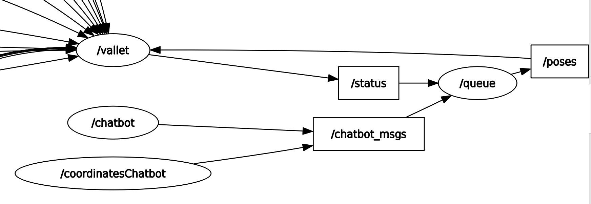

# Mapeamento e navegação

Esta seção da documentação concentra-se no processo essencial que permite a um robô mover-se autonomamente em um ambiente desconhecido. Primeiramente, abordaremos como o robô cria um mapa do ambiente ao seu redor, identificando obstáculos e rotas possíveis. Em seguida, discutiremos a importância de uma interface de comunicação eficaz que permite aos usuários especificar pontos para onde desejam que o robô se mova. Essa interface organiza esses pontos em uma sequência lógica e os transmite ao robô na ordem correta. Este fluxo integrado de mapeamento e comunicação é vital para a autonomia do robô. Abaixo, forneceremos detalhes mais aprofundados sobre cada etapa desse processo, explicando como cada componente contribui para a operação autônoma eficaz do robô.

## Tecnologias

A integração do ROS 2 (Robot Operating System 2), NAV2 (Navigation Stack 2) e TurtleBot3 desempenha um papel central em nossa arquitetura de projeto para sistemas de AMR (Autonomous Mobile Robots), especialmente relevantes para a implementação de navegação autônoma em ambientes industriais. O ROS 2, como sistema operacional para robôs, oferece uma base robusta para o desenvolvimento, enquanto o NAV2, parte integrante do ecossistema ROS 2, fornece recursos avançados de navegação, incluindo algoritmos de mapeamento, localização e planejamento de trajetória.

Nesse contexto, o TurtleBot3, modular e flexível, se conecta ao ROS 2 e NAV2, proporcionando uma plataforma pronta para aplicação prática. Este conjunto de tecnologias possibilita a criação de soluções autônomas e eficientes para robôs de entrega de ferramentas em ambientes industriais. O TurtleBot3, ao se beneficiar da navegação autônoma proporcionada pelo NAV2 e da infraestrutura do ROS 2, pode ser programado para navegar de forma inteligente, otimizando rotas, evitando obstáculos e realizando entregas autônomas.

Em nosso projeto, essa sucessão de tecnologias cria uma base sólida para a automação e eficiência nas operações logísticas internas. A interação entre ROS 2, NAV2 e TurtleBot3 visa impulsionar a navegação autônoma de robôs de entrega de ferramentas, representando um avanço significativo na aplicação de tecnologias de ponta para melhorar as operações industriais. Essa documentação destaca a sinergia entre essas tecnologias, evidenciando como elas se combinam para criar uma solução integrada e eficaz para nossos objetivos de projeto.

### Tópicos e nós 

No contexto do ROS (Robot Operating System), os conceitos fundamentais de nós e tópicos desempenham papéis cruciais na comunicação e coordenação entre diferentes partes de um sistema robótico. Um "nó" no ROS é uma unidade computacional autônoma que executa uma tarefa específica, seja controlar um sensor, processar dados ou realizar ações físicas. Cada nó é um processo independente que se comunica com outros nós para trocar informações.

Os "tópicos" são canais de comunicação que facilitam a troca de dados entre os nós. Eles representam fluxos de informações unidirecionais, onde um nó pode publicar dados em um tópico e outros nós podem se inscrever para receber esses dados. Essa arquitetura baseada em tópicos permite uma comunicação eficiente e desacoplada entre os nós, contribuindo para a modularidade e flexibilidade do sistema.

Em resumo, no ROS, os "nós" são entidades autônomas que executam tarefas específicas, enquanto os "tópicos" são canais de comunicação que possibilitam a troca de dados entre esses nós. Essa abordagem facilita a construção de sistemas robóticos complexos, onde diferentes componentes podem operar de maneira independente e colaborativa por meio de uma estrutura de comunicação flexível e eficaz.

## Módulos

Este projeto é dividido em 2 pacotes, vallet_msgs e vallet que representam respectivamente, as mensagens personalizadas da camada ROS do sistema e o pacote responsável pela navegação e pelo mapeamento de acordo com o contexto onde está sendo implementado o robô ( Turtlebot3 ou Gazebo ). Todos os pacotes estão no mesmo workspace contido na pasta ```src/bridge```. Além disso, como escolha de arquitetura nós implementamos uma camada de comunicação via socket utilizando o pacote "python-socketio". Essa nova implementação serve de "ponte" para distribuir multilateralmente informações entre o ROS e outros serviços externos que necessitam dessa via de comunicação, como por exemplo o WhatsApp.

### Mapeamento

O pacote vallet de contém um launcher que inicia o sistema de mapeamento: turtlebot3_teleop ( navegação manual ) e turtlebot3_cartographer (sistema de cartografia via sensores tal como o SLAM).

#### Execução

Para executá-lo, juntamente com as suas dependências, é preciso seguir as seguintes instruções:

- Na pasta `src/bridge` raíz desse projeto rode o seguinte comando:

```bash
$ colcon build

$ source ./install/local_setup.bash

$ ros2 launch vallet mapping_<turtlebot3/gazebo>.launch.py
```

> [!IMPORTANT]
> Verifique qual a versão do seu shell com o seguinte comando: ```echo $SHELL```, caso ela seja diferente do tipo zsh rode o comando acima com o sufixo bash: ```source ./install/local_setup.zsh```. Se atente à escolha do ambiente ao rodar os comandos, por exemplo, caso vc queira rodar no ambiente simulado do gazebo, rode `ros2 launch vallet mapping_gazebo.launch.py`.

- Após isso, em outro terminal, é preciso rodar o comando abaixo para salvar o mapa gerado pela varredura no mapa:
  
```bash
ros2 run nav2_map_server map_saver_cli -f ./assets/map_<turtlebot3/gazebo>
```

Depois de obter sucesso com os comandos acima, você cumpriu a rotina de mapeamento. Agora basta clicar em CTRL+C para encerrar todos os processos criados pelo script `.sh`

### Navegação
O pacote contém um script sheel que inicia o Rviz com um arquivo de mapa fornecido como argumento. Além disso, há seis nós: um para abrir uma insterface cli, um nó para inicializar a pose do robô, e um nó para gerenciar a fila de pontos. O quinto nó, chamado Vallet, utiliza a API do Simple Commander para comunicação programática com o Nav2. As conexões entre esses tópicos podem ser visualizadas na imagem abaixo. Note que o nó de inicialização de pose não é visível porque ele se encerra assim que a pose é publicada, diferentemente dos outros, que permanecem ativos até o final da interação do usuário.




#### Execução

Para executá-los é preciso seguir as seguintes instruções:

- Na pasta `src/backend` rode o seguinte comando abaixo para iniciar o servidor SocketIO:

```bash
$ python3 websocket_server.py
```

- Na pasta `src/bridge` rode os seguintes comandos:

```bash
$ sudo chmod +x ./vallet_scripts/navigation_<turtlebot3/gazebo>_zsh.sh

$ ./vallet_scripts/navigation_<turtlebot3/gazebo>_zsh.sh SOCKET_URL="<AQUI A URL QUE DO SERVIDOR SOCKETIO>" 
```

> [!IMPORTANT]
> Verifique qual a versão do seu shell com o seguinte comando: ```echo $SHELL```, caso ela difira do tipo zsh rode o comando acima com o sufixo bash: ```sudo chmod +x ./vallet_scripts/navigation_<turtlebot3/gazebo>_zsh.sh SOCKET_URL="<AQUI A URL QUE DO SERVIDOR SOCKETIO>"h```. Se atente à escolha do ambiente ao rodar os comandos, por exemplo, caso vc queira rodar no ambiente simulado do gazebo, rode `sudo chmod +x ./vallet_scripts/navigation_gazebo_zsh.sh SOCKET_URL="<AQUI A URL QUE DO SERVIDOR SOCKETIO>"`.

- Após isso, o sistema estará pronto para receber coordenadas, tanto a partir dos tópicos websocket, quanto a partir da interface cli que foi aberta no XTerm. O tópico ./enqueue fica responsável por enviar os dados, agora transmitidos no formato geometry_msgs.msg.Pose, para o nó fila se inscreve nesse tópico, enfileira os pontos e aguarda o status do nó Vallet para então, de acordo com o feedback do sistema de action do NAV2, enviar uma nova pose para o tópico /dequeue quando o robô estiver disponível.

- Quando uma mensagem é enviada para o tópico /dequeue, ele interage novamente com o sistema de action do NAV2, agora enviando a coordenada para o robô e não somente pegando o feedback da última ordem, chamando a função `go_to_pose()` passando como parâmetro o nosos destino. Após um novo destino ser encaminhado apra o robô, o nó Vallet publica "Busy" no tópico /status, indicando que está ocupado, e posteriormente, "Free" ao finalizar de acordo com um boleano advindo do retorno da função `is_task_complete()`.

## Demo
<iframe width="560" height="315" src="https://youtube.com/embed/vT2ij1Ez19A" frameborder="0" allow="autoplay; encrypted-media" allowfullscreen> </iframe>

### Configurações de Lançamento para Mapeamento

Para a simulação no Gazebo, o lançamento é realizado através do arquivo `mapping_gazebo.launch.py`, que configura o ambiente virtual e os parâmetros de simulação. A seguir, um trecho do arquivo de simulação:

```python
# mapping_gazebo.launch.py
gazebo_dir = get_package_share_directory('turtlebot3_gazebo')
...
PythonLaunchDescriptionSource(gazebo_dir + '/launch/turtlebot3_world.launch.py')
```

Comparativamente, para o Turtlebot3 real, o arquivo `mapping_turtlebot3.launch.py` faz referência ao pacote `turtlebot3_cartographer`, que se liga aos sensores físicos para o mapeamento preciso do ambiente. Aqui está um trecho correspondente:

```python
# mapping_turtlebot3.launch.py
cartographer_dir = get_package_share_directory('turtlebot3_cartographer')
...
PythonLaunchDescriptionSource(cartographer_dir + '/launch/cartographer.launch.py')
```

A diferença chave está no uso do pacote `turtlebot3_cartographer` no lugar de `turtlebot3_gazebo`, refletindo a necessidade de interagir com hardware real ao invés de uma simulação.

### Testes de Integração:

Para comprovar que as rotinas estabelecidas pelos RNFs estão sendo cumpridas pelo sistema do robô, confira o vídeo abaixo.

https://www.youtube.com/embedded/5qHJrIP4e-I

Esse teste cumpre os seguintes RNFs:

- O Robô Autônomo deve ser confiável em termos de orientação e movimentação, tendo uma taxa de erro menor que 20 centímetros.
- O Robô Autônomo deve lidar com alterações pequenas na estrutura do mapa em tempo real, desviando de um obstáculo mesmo se outrora não tivesse sido previsto.
- A integração entre o Robô Autônomo e o Chatbot deve ser robusta, para aguentar duas ou mais requisições, sendo processada em até 5 segundos.