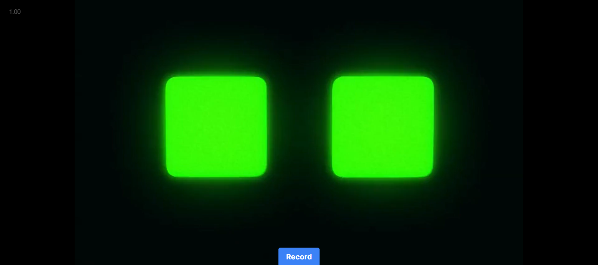

# Interface do robô (LCD)

<p align="center" display="flex" width="300">



</p>
## Introdução

A interface do LCD no robô Vallet desempenha um papel crucial na interação amigável e facilitada para monitoramento do sistema. Essa seção da documentação explora os motivos por trás da criação da interface, suas principais características e fornece instruções sobre como executar e utilizar eficientemente essa ferramenta.

## Objetivo

A principal função da interface do LCD é facilitar consultas intuitivas ao estado atual do sistema no robô Vallet. Esta funcionalidade é aprimorada através da integração de tecnologias avançadas, como Text-to-Speech (TTS) e Speech-to-Text (STT), junto com a utilização do modelo de linguagem GPT (Generative Pre-trained Transformer). Essa integração permite uma comunicação mais natural entre o usuário e o robô.

A conexão direta com o banco de dados é essencial para fornecer informações precisas sobre itens na fila de entrega, itens já entregues e outros dados relevantes. Além disso, as expressões faciais exibidas na tela desempenham um papel crucial ao humanizar a interação, tornando o sistema mais amigável e intuitivo para o usuário.

Toda essa integração acontece através de uma API intermediária em Node.js, que coordena as interações com banco de dados e serviços de inteligência artificial, recebendo os pedidos do usuário e enviando uma resposta de acordo.

## Fluxo de uso

- **Utilização do Botão "Record":**
  Para iniciar uma interação, o usuário pressiona o botão "record" na interface do LCD. Este comando inicia o processo de gravação de voz para que o usuário possa verbalizar suas consultas ou comandos.

- **Gravação e Speech-to-Text (STT):**
  Ao pressionar o botão "record", o robô Vallet começa a gravar a mensagem de voz do usuário. Em seguida, a tecnologia Speech-to-Text (STT) do Google Cloud é aplicada para converter a gravação em texto, tornando a consulta acessível para o sistema.

- **Interação com o Banco de Dados:**
  É feito uma consulta ao banco de dados, recuperando informações específicas sobre o estado atual do sistema, como itens na fila de entrega, histórico de entregas, entre outros.

- **Consulta ao Modelo de Linguagem:**
  O resultado do banco é utilizado como contexto, juntamente da pergunta do usuário, ao modelo de linguagem GPT-3 (OpenAI). Este modelo interpreta o questionamento e gera uma resposta coerente e contextualizada.

- **Text-to-Speech (TTS) e Expressões Faciais:**
  A resposta do sistema é convertida em áudio utilizando a tecnologia Text-to-Speech (TTS) do Google Cloud e, simultaneamente, a expressão facial na tela do LCD reflete a natureza da resposta, adicionando uma dimensão mais humanizada à interação.

- **Feedback ao Usuário:**
  O áudio gerado é reproduzido, proporcionando ao usuário uma experiência de conversação natural. Simultaneamente, as expressões faciais auxiliam na compreensão emocional da resposta, tornando a interação mais envolvente.

Este fluxo de uso, desde a gravação da pergunta até a resposta audiovisual, é projetado para proporcionar uma interação intuitiva e eficaz entre o usuário e o robô Vallet, destacando a sofisticação da interface do LCD.

### Perguntas Comuns

Os usuários podem fazer perguntas sobre o estado do sistema, como:
- Quantos itens estão na fila para entrega?
- Quais itens estão disponíveis?
- Qual é o histórico do dia?
- Alguém já pediu um martelo hoje?

## Restrições

Lembramos que a interface do LCD, conforme atualmente implementada, permite exclusivamente consultas de informações. É importante ressaltar que a capacidade total do sistema, incluindo a funcionalidade de gravação de voz e resposta em áudio, foi testada e validada apenas em ambientes de desenvolvimento, como em computadores pessoais (PCs). O hardware do Modelo Viável do Produto (MVP) atualmente em uso não incorpora componentes como microfone e alto-falante, necessários para a execução completa dessas funções diretamente no LCD do robô.

Entretanto, é fundamental destacar que a versão de produção do robô Vallet, equipada com os componentes necessários, possibilitará a utilização plena da interface do LCD, incluindo a interação por voz, gravação de consultas, e respostas em áudio diretamente no hardware do robô.

Para solicitar novas peças ou efetuar alterações no banco de dados, recomendamos utilizar o chatbot disponível por meio do WhatsApp. Esse canal específico foi designado para garantir a autenticação e a segurança necessárias para realizar ações sensíveis no sistema.

## Como rodar

### Pré-Requisitos

Certifique-se de ter o Node.js instalado em seu ambiente. Caso ainda não o tenha, você pode fazer o download em [Node.js website](https://nodejs.org/).

### Instalação de Dependências

No diretório `src/robot-interface`, execute o seguinte comando para instalar as dependências necessárias:

```bash
npm i
```

### Execução do Sistema
Após configurar as credenciais e instalar as dependências, inicie a interface com o seguinte comando:

```bash
npm run dev
```

O sistema estará pronto para interação na interface do LCD do robô Vallet. Certifique-se de manter o ambiente configurado corretamente para garantir uma execução sem problemas.

## Conclusão

A interface do LCD do robô Vallet é uma adição essencial para melhorar a experiência de interação entre o sistema de delivery e os usuários da cervejaria Ambev. Ao seguir as orientações fornecidas, os usuários poderão utilizar eficientemente as funcionalidades da interface para obter informações relevantes sobre o sistema.
