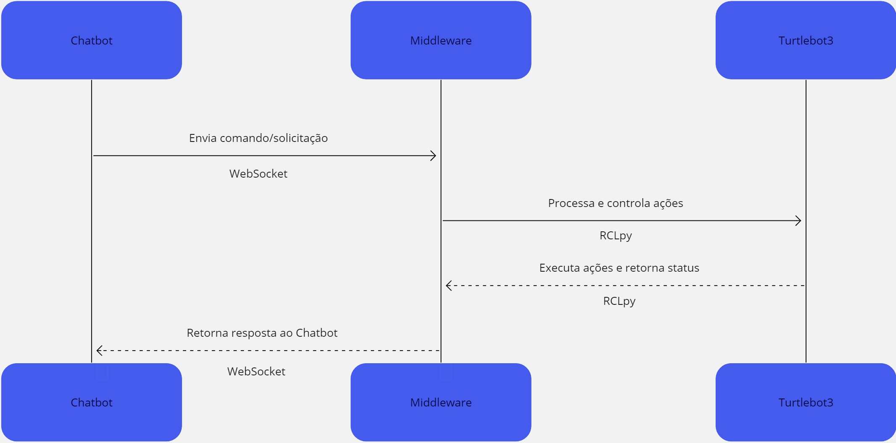

# Integração dos sistemas

## Introdução

Este documento descreve a integração do chatbot do WhatsApp com o ROS2 e o robô Turtlebot3, utilizando a biblioteca SocketIO. Este esforço é parte da terceira fase de um projeto de cinco sprints, focando na melhoria dos processos logísticos na fábrica da Ambev em Guarulhos. A integração permite a comunicação eficiente entre o chatbot e o sistema robótico, facilitando operações autônomas e interações em tempo real.

_Observação: [SocketIO](https://socket.io/docs/v4/) é uma biblioteca JavaScript para aplicações web que permite comunicação bidirecional em tempo real entre clientes e servidores. É amplamente utilizada por sua capacidade de trabalhar com comunicação baseada em eventos e por sua compatibilidade com uma variedade de ambientes e linguagens de programação. Escolhemos essa biblioteca baseada em sua facilidade de implementação de uma comunicação bidirecional, essencial para a eficiência e dinamismo da nossa solução integrada._

## Arquitetura da Integração

Nossa solução de integração é composta por três componentes principais, interligados através de um servidor SocketIO. Abaixo, detalhamos cada componente e descrevemos o fluxo de comunicação envolvendo esse servidor.

1. **Chatbot do WhatsApp:**

   - **Função:** Interage com os usuários, capturando comandos e solicitações.
   - **Comunicação:** Utiliza a API do WhatsApp para interagir com os usuários. Ao receber uma solicitação, o chatbot se conecta ao servidor SocketIO e envia os dados para o Middleware ROS2.

2. **Servidor SocketIO:**

   - **Função:** Facilita a comunicação em tempo real entre o chatbot e o Middleware ROS2.
   - **Comunicação:** Atua como um hub central, recebendo dados do chatbot e redirecionando-os ao Middleware ROS2. O servidor SocketIO garante uma conexão estável e eficiente, essencial para a troca rápida de informações.

3. **Middleware ROS2:**

   - **Função:** Recebe dados do servidor SocketIO e controla o Turtlebot3.
   - **Comunicação:** Estabelece comunicação com o servidor SocketIO para receber comandos do chatbot. Processa essas informações e as traduz em ações específicas para o Turtlebot3.

4. **Turtlebot3:**
   - **Função:** Executa as ações com base nas instruções recebidas.
   - **Comunicação:** Recebe comandos do Middleware ROS2 e realiza as ações necessárias. A comunicação entre o Middleware ROS2 e o Turtlebot3 é efetuada através dos nós ROS2.

### Fluxo de Comunicação

1. **Usuário para Chatbot:** O usuário envia um comando ou solicitação através do WhatsApp.
2. **Chatbot para Servidor SocketIO:** O chatbot interpreta o comando e envia as coordenadas ao servidor SocketIO.
3. **Servidor SocketIO para Middleware ROS2:** O servidor recebe os dados e os redirecionam para o Middleware ROS2.
4. **Middleware ROS2 para Turtlebot3:** O Middleware ROS2 processa as coordenadas e enviam elas para um outro nó responsável por gerenciar os pontos para os quais o robô deve ir.
5. **Execução pelo Turtlebot3:** O Turtlebot3 executa as ações baseadas nos comandos recebidos.

Esta arquitetura, com a inclusão do servidor SocketIO, assegura uma comunicação fluida e em tempo real entre o usuário final, o chatbot, e o robô, permitindo uma interação dinâmica e eficiente.



## Detalhes Técnicos

1. **Integração com WhatsApp e Chatbot (`openai.ts`):**

   - Script TypeScript para integração da API do ChatGPT/OpenAI com WhatsApp.
   - Código chave com comentários:

   ```typescript
   // Importando APIs necessárias
   import { ChatGPTAPI } from "chatgpt";
   import { Configuration, OpenAIApi } from "openai";

   // Rota do webhook para processamento de mensagens do WhatsApp
   app.post("/webhook", (req, res) => {
     const userMessage = req.body.message; // Capturando mensagem do usuário
     const chatbotResponse = ChatGPTAPI.processMessage(userMessage); // Processando mensagem
     sendMessageToUser(chatbotResponse); // Enviando resposta para o usuário
   });

   // Configuração da conexão WebSocket e lógica atrelada ao GPT
   export async function getPointOpenAI(message: Message, points) {
     let prompt =
       "Responda a pergunta abaixo com base no contexto para encontrar as coordenadas do lugar. Fique atento para possíveis variações no nome quando o usuário perguntar.Sempre responda na língua que o usuário se comunicar. Sempre dê as coordenadas no formato ([x], [y], [z])";
     let jsonPoints = JSON.stringify(points);

     let question = `Lista de pontos: ${jsonPoints}. Pergunta: Identifique a responsta do usuário com base na lista de pontos Resposta: ${message.body} e depois coloque as coordenadas do ponto em formato de float.`;

     const response = await openai.createChatCompletion({
       model: "gpt-4",
       messages: [
         { role: "system", content: prompt },
         { role: "user", content: question },
       ],
     });

     let pointResponse = response.data.choices[0].message?.content;

     const regex: RegExp =
       /-?\d+(?:\.\d+)?,\s*-?\d+(?:\.\d+)?,\s*-?\d+(?:\.\d+)?/gi;
     const match = pointResponse?.match(regex);
     // Iniciando conexão Socket
     const socket = io("http://10.128.64.39:3000");
     if (match) {
       match.forEach((coordinateString) => {
         // Splitting the matched string into individual numbers
         const parts = coordinateString
           .split(",")
           .map((part) => parseFloat(part.trim()));
         const [x, y, z] = parts;
         socket.emit("send_points", { x, y, z });
         message.reply(pointResponse as any);
       });
     } else {
       message.reply("Não consegui encontrar o ponto. Tente novamente.");
     }
   }
   ```

2. **Gerenciamento de Dados e Comunicação (`streamer.py`):**

   - `websocket_streamer.py` para gerenciamento da transmissão de dados, atua em nossa solução como um middleware entre o ROS2 e o servidor SocketIO.
   - Código chave com comentários:

   ```python
   class ClientWebSocket(Node):
       def __init__(self):
           super().__init__("client_websocket")  # Inicializa a classe base Node com o nome "client_websocket"

           self.sio = socketio.Client()  # Cria um cliente SocketIO
           self.sio.connect("http://localhost:3000")  # Conecta o cliente SocketIO ao servidor na URL especificada

           self.enqueue = Publisher(self, "enqueue", "/enqueue", Pose)  # Cria um publicador para a fila de mensagens

           self.status = Subscriber(self, "status", "/status", String)  # Cria um assinante para receber atualizações de status

           # Cria um objeto Streamer que lida com a transmissão de dados e interage com o cliente SocketIO
           self.streamer = Streamer(self, self.sio, "/navigation", self.status, self.add_to_queue, self.enqueue)

       def add_to_queue(self, data: dict[str, float]):
           # Método para adicionar dados à fila. Registra informações e publica no tópico 'enqueue'
           self.get_logger().info(f"Received data: {data} and publishing on {self.enqueue.topic_name}")
           pose = Pose()  # Cria um novo objeto Pose
           pose.position.x = data["x"]  # Define a posição x do Pose
           pose.position.y = data["y"]  # Define a posição y do Pose
           pose.position.z = 0.0  # Define a posição z do Pose como 0.0
           self.enqueue.publish(pose)  # Publica o objeto Pose no tópico 'enqueue'
   ```

3. **Controle e Navegação do Robô (`vallet.py`):**

   - `vallet.py` gerencia o controle do Turtlebot3 através do ROS2.
   - Código chave com comentários:

   ```python
    # Importações ROS2 para controle e navegação do robô
    from geometry_msgs.msg import Pose, Point, Quaternion
    from nav2_simple_commander.robot_navigator import BasicNavigator

    # Classe para controle do navegador do robô
    class NavigatorController(Node):
        ...
        # Método para publicar o status do robô
        def publish_status(self, status):
            msg = String()
            msg.data = status
            self.robot_status.publish(msg)  # Publicando status do robô

        # Método para executar comandos de navegação
        def execute_command(self, command):
            if command['action'] == 'move':
                # Movendo o robô para uma pose específica
                self.navigator.go_to_pose(self.create_pose(command['x'], command['y'], command['theta']))
            elif command['action'] == 'stop':
                # Cancelando a navegação
                self.navigator.cancel_navigation()

        def go_to_pose(self, pos_x, pos_y, rot_z):
            goal_pose = self._create_pose_stamped(pos_x, pos_y, rot_z)
            self.navigator.goToPose(goal_pose)
        ...

    class Vallet(Node):
       ...
       def listener_callback(self, msg: Pose):
           pos_x = msg.position.x
           pos_y = msg.position.y
           pos_z = msg.position.z
           self.navigator_controller.go_to_pose(pos_x, pos_y, pos_z)
       ...
   ```

### Processo de Integração

- Implementamos uma comunicação robusta entre o chatbot no WhatsApp, o servidor backend (TypeScript e Python), e o controle do Turtlebot3 via ROS2.
- Os comandos dos usuários são processados pela API do ChatGPT/OpenAI, transmitidos via WebSocket pelo `streamer.py`, e então encaminhados ao `vallet.py` para execução no Turtlebot3.

### Teste e Validação

Durante a fase de teste e validação, conduzimos uma série de experimentos para garantir a eficácia e a confiabilidade da integração entre o chatbot do WhatsApp, a API do ChatGPT/OpenAI, e o sistema robótico ROS2 com Turtlebot3. Os testes foram estruturados para avaliar vários aspectos do sistema, incluindo a precisão da interpretação dos comandos do chatbot, a eficiência da comunicação via SocketIO, e a precisão e segurança na navegação do robô.

1. **Teste do Chatbot**: Validamos a capacidade do chatbot de entender e responder com precisão às solicitações dos usuários. Isso incluiu testes de diálogo em situações variadas para assegurar a robustez do processamento de linguagem natural.
2. **Teste de Comunicação com o SocketIO**: Verificamos a estabilidade e a rapidez da comunicação entre o backend do sistema e o Turtlebot3. Os comandos foram transmitidos sem interrupções e em tempo real, assegurando uma operação fluida e contínua.
3. **Teste de Navegação do Robô**: O Turtlebot3 foi submetido a vários cenários de navegação para garantir que ele se movimentasse e executasse tarefas conforme as instruções recebidas. Observamos a precisão na execução de comandos, a habilidade de evitar obstáculos e a eficiência no cumprimento das tarefas.

Os resultados dos testes foram satisfatórios, demonstrando que o sistema integrado é capaz de operar de maneira eficiente e confiável. A documentação detalhada desses testes, juntamente com um vídeo gravado das sessões de teste, fornece uma visão clara da funcionalidade e eficácia do sistema. Esta fase de teste e validação é crucial para assegurar que nosso sistema não só atenda às expectativas teóricas, mas também funcione de maneira eficiente e segura no ambiente real da fábrica. O vídeo gravado das sessões de teste servirá como uma demonstração prática dos resultados obtidos e da operação do sistema no contexto real.

<iframe width="560" height="315" src="https://youtube.com/embed/zAUZRT7so_g?" frameborder="0" allow="autoplay; encrypted-media" allowfullscreen> </iframe>

## Conclusão

A integração entre o chatbot do WhatsApp e o sistema robótico ROS2 e Turtlebot3 representa um avanço significativo na automação e eficiência da logística na fábrica da Ambev, objetivo de nosso projeto. Esta inovação melhora a produtividade e oferece uma interface de usuário intuitiva e eficaz. Os códigos comentados fornecem uma visão clara da lógica e funcionamento interno do projeto a os interessados, destacando a complexidade e eficácia da solução desenvolvida.
