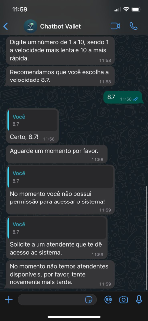
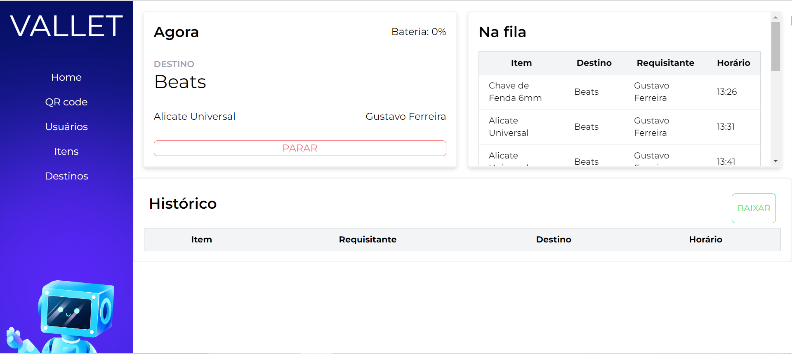
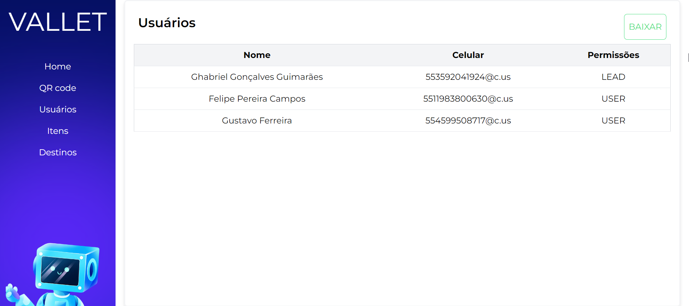
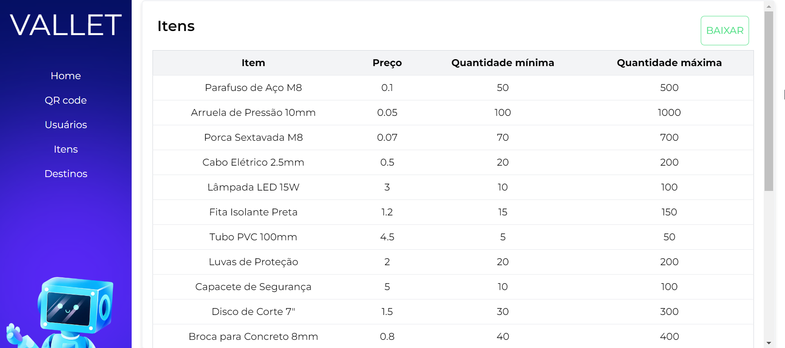
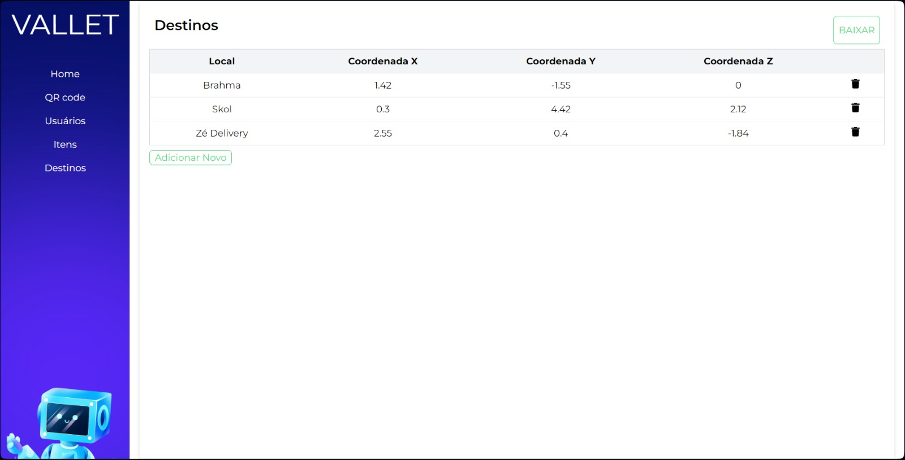

# Manual do Usuário: Sistema Integrado de Automação com TurtleBot 3

Segue abaixo o manual do sistema de automação com TurtleBot 3, projetado para aprimorar processos de coleta e entrega de peças e ferramentas do almoxarifado da AMBEV a todo seu setor industrial. Este manual fornecerá uma visão abrangente do sistema, incluindo montagem, configuração, operação e manutenção.

## Descrição do Sistema

A solução consiste em fornecer aos trabalhadores e técnicos da AMBEV um chatbot em seu Whatsapp conectado a um banco de dados contendo os itens presentes no almoxarifado. Com isso, o tecnico pode realizar quantas solicitacoes necessitar via audio ou mensagem e não precisará se locomover para buscar seu pedido, o que sera a principal resposabilidade do VALET. Não apenas, oferecemos um controle admin dos users e dos relatórios dessas transações, que pode ser acessado em uma plataforma web, para um maior conforto e controle de nosso cliente sobre as operações.

### Materiais e Componentes

- TurtleBot 3 
- LCD (HDMI e Cabo USB)
- Telefone celular com Whatsapp
- Computador conectado à internet

### Funcionalidades do Sistema
Considerando o fluxo de nossa solução, existem algumas features que valem a pena ser avaliadas mais a fundo sobre como as desenvolvemos:

- [Mapeamento e navegação](https://2023m8t2-inteli.github.io/grupo4/docs/Desenvolvimento%20da%20Solu%C3%A7%C3%A3o/3.2%20Mapeamento%20e%20navega%C3%A7%C3%A3o)
- [Chatbot](https://2023m8t2-inteli.github.io/grupo4/docs/Desenvolvimento%20da%20Solu%C3%A7%C3%A3o/3.3%20Chatbot)
- [LLM](https://2023m8t2-inteli.github.io/grupo4/docs/Desenvolvimento%20da%20Solu%C3%A7%C3%A3o/3.5%20LLM)
- [WebSocket](https://2023m8t2-inteli.github.io/grupo4/docs/Desenvolvimento%20da%20Solu%C3%A7%C3%A3o/3.6%20Interface%20de%20admin)
- [Interface Admin](https://2023m8t2-inteli.github.io/grupo4/docs/Desenvolvimento%20da%20Solu%C3%A7%C3%A3o/3.6%20Interface%20de%20admin) 

## Interfaces

### Novo user:
Os primeiros passos de um novo user será entrar em contato com o chat, que irá perguntar algumas informacoes para realizar seu devido cadastro e solicitar acesso a um administrador.


Em seguida o usuário poderá personalizar seu chatbot com o tipo de voz e velocidade da mesma e, caso ainda nâo tenha sido liberado a este número o acesso, reforçará a necessidade de solicita-lo Admin.



### User:

O User cadastrado, terá algumas opções de ações que pode realizar, sendo solicitacao de peça e acompnhamento as principais features da solução. Em seguida, ele será guiado pelo chatbot para realizar seu pedido, podendo responder em áudio ao chatbot. 


Segue uma interacao de um usario cadastrado com nossa DEMO:

<iframe width="560" height="315" src="https://youtube.com/embed/5qHJrIP4e-I" frameborder="0" allow="autoplay; encrypted-media" allowfullscreen> </iframe>

### Admin:

No caso do admin. Ele poderá liberar acessos e cadastrar novos pontos de rotas para o robô entregar ou buscar peças.


O Admin deve escolher sua opção e será guiado pelo chatbot para completar as informações e realizar sua alteração.


### Interface web Admin:

Aqui o usúario conta com uma interface intuitva. com menu á esquerda dando acesso ao QR code do chatbot e outras abas de controle e dashboards interativos para observar o andamento de ocorrências e transações na fábrica.



Na ordem de cima para baixo do menu, encontra-se a aba "Usuarios", que permite que o Admin tenha uma visao geral de usuarios ativos da aplicação e suas informacoes de cadastro e permissões.



Em seguida, temos acesso aos itens cadastrados em nosso bando de dados, que ja apresentando detalegs como preco, quantidade minima e maxima para solicitação.



Logo abaixo na aba "Destinos", pode-se analisar todos os pontos cadastrados na solucao 




### Processamento de Comandos de Voz

A fim de reforçar o diferencial da aplicação, o chatbot e robô oferecem acessibilidade e usabilidade facilitada ao usuário, com o sistema que processa comandos de voz através de tecnologias Speech-to-Text e Text-to-Speech da OpenAI, permitindo interações intuitivas e rapidas entre os técnicos e esta nova tecnologia.

## Configuração e Execução

#### Pré-Requisitos

- **Docker Instalado**: O cliente precisa ter o Docker instalado em seu sistema. Se ainda não tiver, pode instalar a partir do [site oficial do Docker](https://www.docker.com/get-started).

### Chatbot e Bridge:

Para rodar o ChatBot e o Robô, siga as instruções abaixo com atenção. Estes passos são essenciais para iniciar a aplicação de forma correta e garantir seu funcionamento adequado.

### Passo a Passo

1. **Baixar a Imagem do Container**
   - Primeiro, o cliente precisa baixar a imagem do container do registro onde ela está hospedada. Se for o Docker Hub, o comando será algo como:
     ```
     docker pull nome_do_usuario/nome_da_imagem:tag
     ```
     Aqui, `nome_do_usuario` é seu nome de usuário no Docker Hub, `nome_da_imagem` é o nome que você deu para a imagem, e `tag` é a tag específica da versão da imagem (por exemplo, `latest`).

2. **Executar o Container**
   - Após baixar a imagem, o cliente pode executar a aplicação com o seguinte comando:
     ```
     docker run -p 3000:3000 nome_do_usuario/nome_da_imagem:tag
     ```
     Isso irá iniciar o container e mapear a porta 3000 do container para a porta 3000 da máquina local.

3. **Acessar a Aplicação**
   - Com o container rodando, a aplicação estará acessível em `http://localhost:3000` no navegador do cliente ou através de qualquer cliente que faça requisições para esta porta.

### Interface Web:

#### Pré-Requisitos

Certifique-se de ter o Node.js instalado em seu ambiente. Caso ainda não o tenha, você pode fazer o download em [Node.js website](https://nodejs.org/).

#### Instalação de Dependências

No diretório `src/robot-interface`, execute o seguinte comando para instalar as dependências necessárias:

```bash
npm i
```

#### Execução do Sistema
Após configurar as credenciais e instalar as dependências, inicie a interface com o seguinte comando:

```bash
npm run dev
```

### 11. Conclusão e Contatos

Com esses passos e direcionamento anteriores, o cliente pode começar a utlizar e adaptar nossa solução a seu ambiente e logística. Tratando-se de um MVP, nossa solução conta com alguns passos de execução com a utilização do Docker. Porém ja demonstra praticidade e confiabilidade por parte do cliente em interações nos encontro. Por fim, nossa solução foi bem vista pelos representantes da AMBEV e com nossa base pode-se surgir um novo metodo, escalavel e confivel, de indoor delivery nos ambientes industriais.
