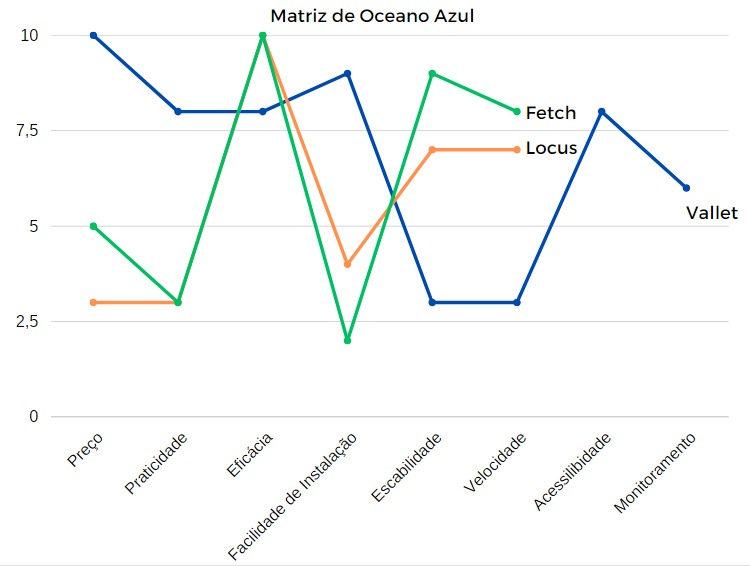

# Matriz Oceano Azul

Nesta secção há a matriz oceano azul, que visa identificar vantagens comptetitivas comparadas aos outros players do mercado, em uma escala de 0 à 10, dado que 10 é o melhor resultado possível e 0 o pior.

Foram comparadas as empresas Fetch Robotics e Locus Robotics que oferecem serviços de organização de armazéns. Segue link dos vídeos usados de referência:

- [Fetch Robotics](https://youtu.be/oki2V44W948?si=IcqT4KrD15UMv0Qd);
- [Locus Robotics](https://youtu.be/vR1HCzpESTw?si=9gLp_v73VkkZKQtM);

Os atributos que foram selecionados para serem comparados são: Preço, Praticidade, Eficácia, Facilidade de Instalação e Escalabilidade.

- Preço: Custo geral de aplicação da solução;
- Praticidade: Facilidade e necessidade de mobilização da equipe para a execução do projeto no dia à dia;
- Eficácia: Quanto de fato resolve o problema a solução;
- Facilidade de instalação: Quanto é necessário mobilizar para poder aplicar a solução, seja parar a produção, redirecionar os esforços dos funcionários, rearranjar as gôndolas, entre outros;
- Escalabilidade: O quão viável é para aumentar a operação;
- Acessibilidade: O quanto uma pessoa que possui algum tipo de dificuldade cognitiva ou corporal conseguem usar;
- Velocidade: Quão rápido o robô consegue executar a tarefa;
- Monitoramento: O quanto é possível acompanhar a operação como usuário;

|   Soluções   | Preço | Praticidade | Eficácia | Facilidade de Instalação | Escalabilidade | Velocidade | Velocidade | Monitoramento |
| :------------: | :----: | :---------: | :-------: | :------------------------: | :------------: | :--------: | :--------: | :-----------: |
|     Vallet     |   10   |      8      |     8     |             9             |       3       |     3     |     8     |       6       |
| Locus Robotics |   3   |      3      |    10    |             4             |       7       |     7     |     0     |       0       |
| Fetch Robotics |   5   |      3      |    10    |             2             |       9       |     8     |     0     |       0       |

**Reduzir**

- Tempo e dificuldade de instalação

**Aumentar**

- Praticidade no cotidiano

**Criar**

- acessibilidade para PCDs, pessoas com condições debilitantes temporárias e situacionais
- Monitoramento dos robôs para pelo usuário

**Eliminar**

- Deslocamento do técnico até o almoxarifado

# Conclusão

O problema trazido pela Ambev envolve a aplicação de um robô autonomo que facilite a movimentação das peças entre técnicos e amoxarife. No entanto o tamanho do almoxarifado e área de aplicação são relativamente pequenas. Dado o contexto e a partir dos atributos comparados, conclui-se que ambas soluções, Fetch Robotics e Locus Robotics, apresentam um custo e lapidagem demasiada para o que o parceiro deseja agora. Isto é, devido ao seu alto custo, alta eficácia e dificuldade de instalação ambas soluções são complexas demais para serem empregadas no contexto de teste e POC, podendo ser considerá-las, como o ditado popular, "uma bala de canhão para matar uma formiga". Após a aplicação da POC e o um resultado positivo a partir dela, então se recomenda a implementação de outras soluções similares à Locus ou à Fetch, que podem ser aplicadas em larga escala industrial. O Vallet, portanto, serve para preencher essa lacuna entre ausência de protótipos e produtos definitivos, objetivando viabilizar e demonstrar a aplicação do projeto em menor escala.
