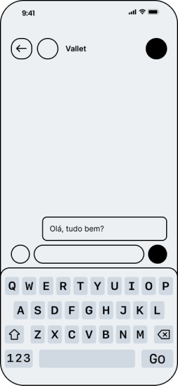

# Chatbot

Durante a Sprint 2 do projeto, direcionamos nossos esforços para o desenvolvimento de um protótipo de chat integrado ao robô. Inicialmente implementado em Python, esse chatbot visa ser um ponto de contato entre o usuário e o sistema. Esse passo inicial permite que compreendamos as necessidades e desafios específicos da interação com o robô, proporcionando uma base sólida para a evolução do sistema.

Além disso, planejamos uma transição estratégica para o WhatsApp em um futuro próximo. Essa escolha é motivada pela ampla acessibilidade e popularidade do WhatsApp, sendo um aplicativo já integrado aos dispositivos móveis da maioria dos usuários. Essa transição visa não apenas facilitar a adoção do sistema, mas também garantir que a interação ocorra em um ambiente familiar e confortável para os usuários, minimizando a curva de aprendizado e otimizando a eficácia da interface.

## CLI

O Chatbot em CLI representa a primeira iteração para a Sprint 2 do projeto, proporcionando uma interface de linha de comando para que usuários enviem comandos de movimentação a um robô na cervejaria do futuro de Guarulhos. Essa versão é um passo inicial, pois o objetivo futuro é integrar essa funcionalidade em um chat do WhatsApp, tornando a interação mais acessível e conveniente.

O chatbot utiliza expressões regulares para identificar a intenção do usuário, classificando-as em categorias como cumprimento, despedida e solicitações relacionadas aos diferentes locais da cervejaria. Cada intenção está associada a um destino específico na cervejaria, representado por coordenadas (x, y, z) no espaço tridimensional.

O código incorpora dois dicionários: self.intencoes mapeando expressões regulares para intenções e self.destinos mapeando intenções para as coordenadas correspondentes de destino. O chatbot publica as mensagens de posição no tópico 'chatbot_msgs' utilizando o ROS 2. O loop principal do programa solicita entradas do usuário, identifica a intenção por meio das expressões regulares e executa a ação correspondente, como o direcionamento do robô para um local específico na cervejaria.

Além disso, o código fornece métodos para mover o robô para os destinos associados às intenções, encerrar o chat e imprimir mensagens apropriadas. A inicialização do ROS 2 é realizada no método main(), que cria uma instância do chatbot, inicia a conversa e, posteriormente, encerra o ROS 2. A execução do chatbot pode ser feita diretamente com o comando ros2 run navigator chatbot após a compilação do workspace, embora seja recomendado integrá-lo ao restante do sistema usando um script bash na raiz do workspace. Em conjunto, esse código oferece uma interface interativa para controlar o movimento do robô na cervejaria com base nas intenções expressas pelos usuários por meio de mensagens de texto.

## Protótipo de Baixa Fidelidade

Para essa sprint 2, o grupo desenvolveu o protótipo de baxa fidelidade das interações e funções que o usuário irá ter com o chatbot. O protótipo foi desenvolvido no Figma, uma ferramenta de design que permite a criação de protótipos de baixa e alta fidelidade. O protótipo pode se acessado por meio do [link de acesso](https://www.figma.com/file/30UeP53WIJoLGIjlzd61if/Pr%C3%B3totipo-de-Baixa-Fidelidade?type=design&node-id=0%3A1&mode=design&t=G1gccUgdLWDn5Nad-1). Lá será possivel encontrar o prototipo de baixa fidelidade do chatbot, e também o prototipo de baixa fidelidade do display e página web de cadastro do chatbot.

