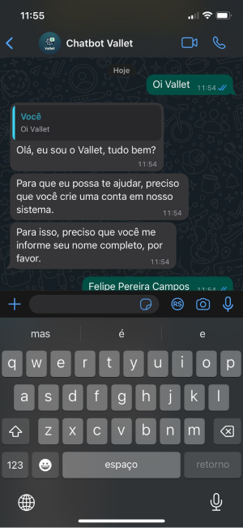
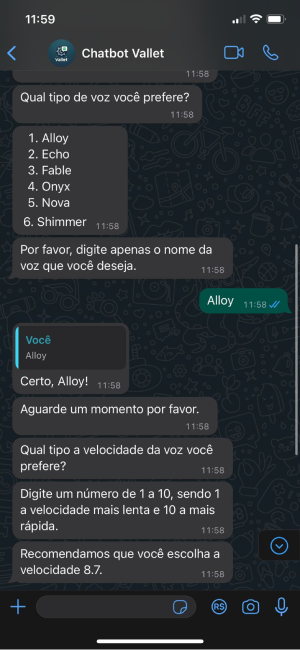
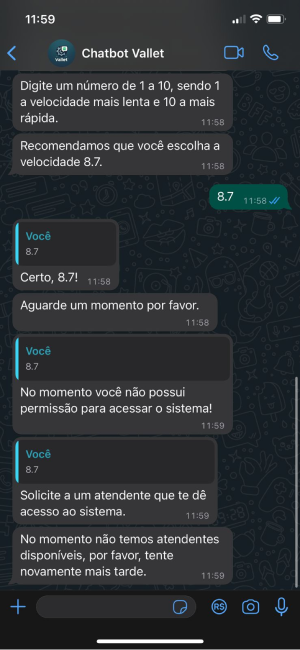

# Acessibilidade no Chatbot

Durante a Sprint 4, o grupo desenvolveu novas funcionalidades para o chatbot, visando torná-lo mais acessível a usuários com deficiências. Isso incluiu destacar os tópicos abordados ao longo de toda a construção do projeto.

## Material UI Design

O grupo optou por usar o próprio WhatsApp como 'front-end' para interagir com os usuários do chatbot. Além disso, esse aplicativo é a ferramenta principal de comunicação entre os funcionários da AMBEV. A escolha do WhatsApp como plataforma se destaca por sua acessibilidade, já que diversos leitores de tela e ferramentas de assistência para pessoas com deficiência são compatíveis com ele. Além disso, o WhatsApp é um aplicativo amplamente utilizado, com mais de 2 bilhões de usuários em todo o mundo. Isso significa que a maioria dos usuários já está familiarizada com a interface do WhatsApp, o que facilita a adoção do chatbot.

## Escolha de Voz no TTS

Uma das funcionalidades desenvolvidas durante a Sprint 4 foi a escolha de voz no TTS. Durante o cadastro da conta no chatbot, o usuário pode escolher a voz que deseja ouvir nas mensagens de áudio enviadas pelo chatbot. Essa funcionalidade foi desenvolvida com o objetivo de tornar o chatbot mais acessível a usuários com deficiências visuais. O chatbot possui 6 vozes disponíveis, que podem ser escolhidas pelo usuário. São elas: `Alloy`, `Echo`, `Fable`, `Onyx`, `Nova` e `Shimmer`. Vale ressaltar que todos esses estilos de voz são fornecidos pelo próprio modelo de `tts` da OpenAI. A escolha da voz é realizada por meio de um mensagem enviada pelo usuário, que é processado pelo chatbot e armazenado no banco de dados.

## Escolha de Velocidade de Voz no TTS

Já a funcionalidade de escolha da velocidade da voz no TTS foi desenvolvida com o objetivo de tornar o chatbot mais acessível a usuários com deficiências auditivas. Durante o cadastro da conta no chatbot, o usuário pode escolher a velocidade da voz que deseja ouvir nas mensagens de áudio enviadas pelo chatbot. A escolha da velocidade da voz pode ser feita atribuindo uma nota de 0 a 10, sendo que a nota 8.7 é sempre recomendada, pois foi constatada como a velocidade ideal em testes. Essa escolha da velocidade é realizada por meio de uma mensagem enviada pelo usuário, que é processada pelo chatbot e armazenada no banco de dados.

## Teste do Chatbot

### Testes Esteira de Produção

Ao longo da Sprint 4, foram realizados testes de integração entre o chatbot e a esteira de produção. O objetivo desses testes foi verificar se o estava conseguido buildar, criar uma imagem docker enviando para o repositório do ECR e realizar o deploy no EC2. O teste foi realizado com sucesso, como pode ser visto na imagem abaixo e acessado no link [clicando aqui](https://github.com/2023M8T2-Inteli/grupo4/actions/runs/7253451488).

### Testes com o Parceiro

Durante a apresentação do projeto para o parceiro, foi realizado um teste com o chatbot. O teste consistiu em realizar o cadastro de um novo usuário no chatbot, e em seguida realizar uma solicitação de peça. A ideia do teste foi mostrar para o parceiro como o chatbot funciona, e como ele pode ser utilizado para realizar solicitações de peças. Isso consolidou em informações importantes para o projeto, como a necessidade de melhorar o menu de cadastro do chatbot, e também a necessidade de melhorar a forma como o chatbot se comunica com o usuário em alguns momentos, como o de escolha de voz e velocidade de voz. Mas no geral, o teste foi bem sucedido, e o parceiro conseguiu entender como o chatbot funciona e como ele pode ser utilizado para realizar solicitações de peças.

### Testes de Usabilidade

Por mais que utilizamos a interface do WhatsApp para interagir com o chatbot, o grupo realizou testes de usabilidade com o chatbot. O objetivo desses testes era verificar se o chatbot estava conseguindo realizar as funções que ele se propõe a fazer, e também verificar se o chatbot estava conseguindo se comunicar com o usuário de forma clara e objetiva. Isso foi feito por meio da validação de requisitos, com o professor de UX, deixando o utilizador livre para interagir com o chatbot. Os testes foram realizados com sucesso, e o chatbot conseguiu realizar todas as funções que ele se propõe a fazer, e também conseguiu se comunicar com o usuário de forma clara e objetiva.