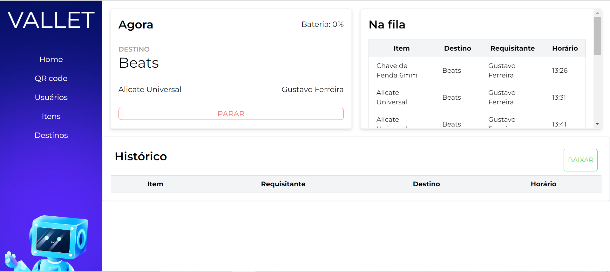
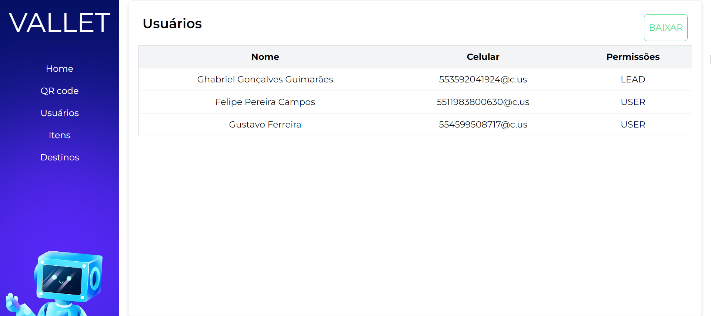
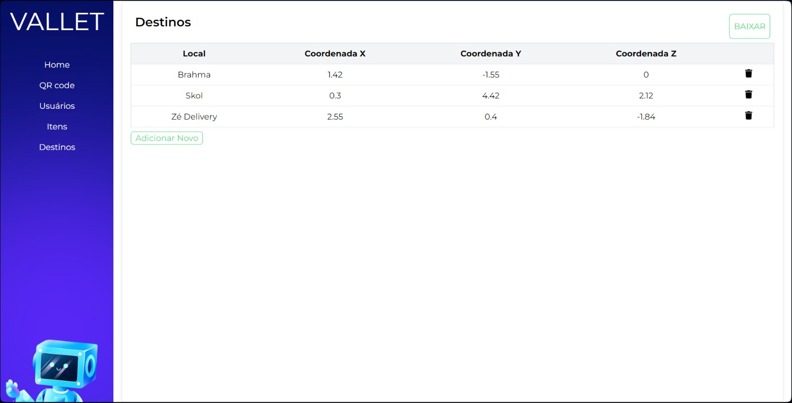
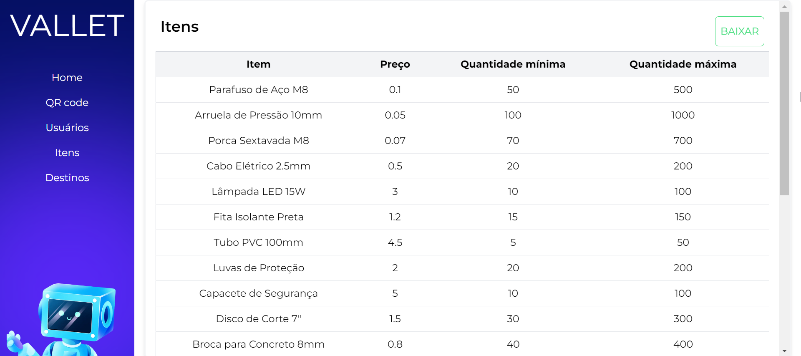

# Interface de Administração

<p align="center" display="flex" width="300">



</p>

A Interface de Administração do sistema fornece ao administrador uma visão abrangente e detalhada do funcionamento do robô Vallet, permitindo o monitoramento e controle eficazes de diversas facetas do sistema. Esta interface é acessível exclusivamente por meio de computadores pessoais (PCs) e requer autenticação do administrador para garantir a segurança e controle de acesso.

## Visão Geral do Sistema

A página inicial da Interface de Administração apresenta uma visão geral do sistema, destacando informações cruciais, como o status atual da ordem em execução, a fila de ordens pendentes, histórico de ordens recentes, nível da bateria do robô, e um botão de parada de emergência para interrupções imediatas, se necessário.

Toda essa integração acontece através de uma API intermediária em Node.js, que coordena as interações com banco de dados, recebendo os pedidos do usuário e enviando uma resposta de acordo.

## Módulos Principais

### 1. Ordens em Execução

Nesta seção, é exibida a ordem atualmente em execução, proporcionando uma visão detalhada do progresso e do status do robô durante sua operação.

### 2. Fila de Ordens

A fila de ordens apresenta uma lista das ordens pendentes, permitindo ao administrador visualizar, priorizar e gerenciar eficientemente as solicitações de entrega.

### 3. Histórico de Ordens

O histórico de ordens oferece uma visão cronológica das ordens anteriores, fornecendo informações valiosas sobre o desempenho passado do robô.

### 4. Nível da Bateria

Esta seção exibe o nível atual da bateria do robô Vallet, permitindo ao administrador monitorar a autonomia disponível e tomar ações preventivas, se necessário.

### 5. QR Code

Esta seção dispõe um QR Code, renderizado a cada 10 segundos, que contém o link para o chatbot no Whatsapp. Caso o usuário já esteja autenticado, o usuário é informado, dispensando a necessidade de exibir o qrcode. 

### 6. Botão de Parada de Emergência

O botão de parada de emergência proporciona ao administrador a capacidade de interromper imediatamente as operações do robô em situações críticas.

### 7. Usuários Cadastrados

A área de usuários cadastrados lista os usuários autorizados a interagir com o sistema, proporcionando ao administrador um controle granular sobre as permissões e acessos.

### 8. Destinos Cadastrados

Nesta seção, o administrador pode visualizar e gerenciar os destinos disponíveis para entrega, facilitando a configuração e ajuste conforme necessário.

### 9. Ferramentas Cadastradas

Exibe uma lista das ferramentas cadastradas no sistema, permitindo ao administrador monitorar o inventário e realizar atualizações conforme necessário.

### 10. Log de Eventos do Sistema

O log de eventos mantém um registro detalhado das atividades do sistema, proporcionando ao administrador insights valiosos para diagnóstico e manutenção.

### 11. Botão de Download de Planilhas

O download de planilhas pode ser feito no botão verde presente no canto superior direito da tela, que são baixados em arquivos com formato csv(comma-separated-values).

## Screenshots

#### Home com módulos de fila, histórico e pedido atual

#### Usuários

<p align="center" display="flex" width="300">



</p>

#### Destinos

<p align="center" display="flex" width="300">



</p>

#### Itens

<p align="center" display="flex" width="300">



</p>

## Como rodar

### Pré-Requisitos

Certifique-se de ter o Node.js instalado em seu ambiente. Caso ainda não o tenha, você pode fazer o download em [Node.js website](https://nodejs.org/).

### Instalação de Dependências

No diretório `src/robot-interface`, execute o seguinte comando para instalar as dependências necessárias:

```bash
npm i
```

### Execução do Sistema

Após configurar as credenciais e instalar as dependências, inicie a interface com o seguinte comando:

```bash
npm run dev
```

## Conclusão

Em síntese, a Interface de Administração do sistema representa uma ferramenta robusta e abrangente para o controle eficaz do robô Vallet. Ao proporcionar uma visão detalhada do status operacional, ordens em execução, fila de ordens e outros aspectos vitais do sistema, ela capacita os administradores a monitorarem e gerenciarem o desempenho do robô de maneira eficiente.
